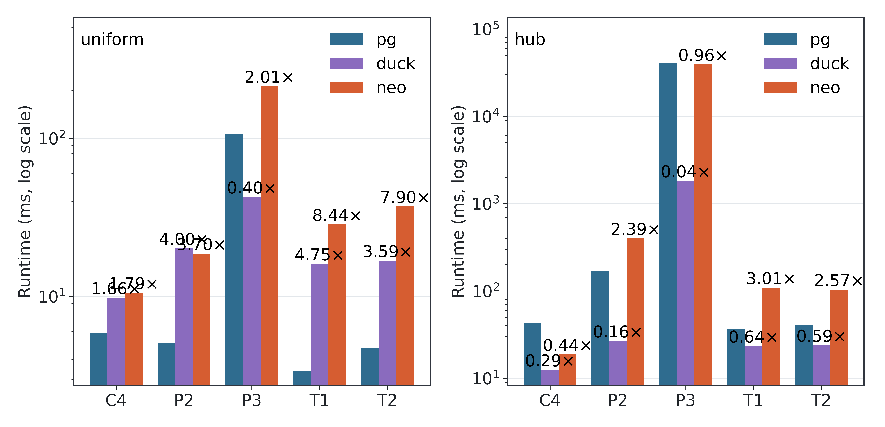
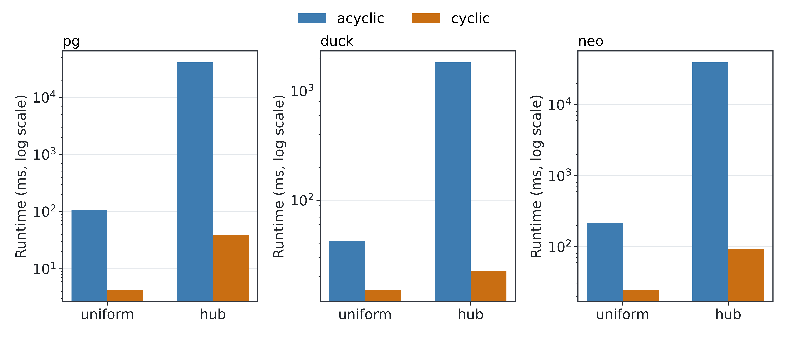
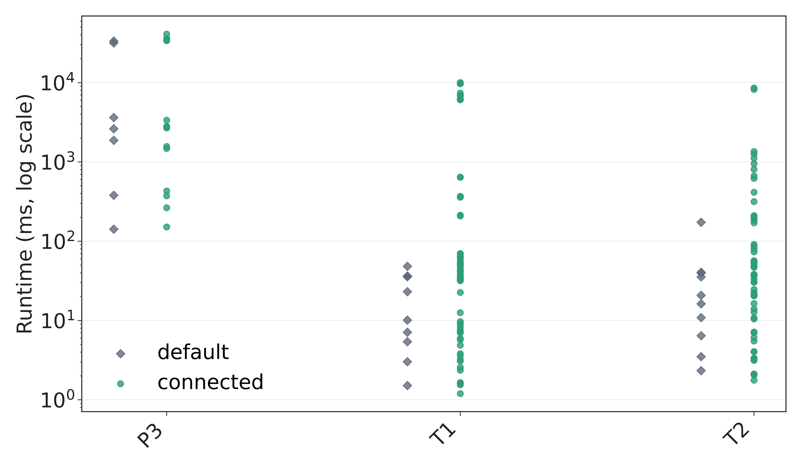
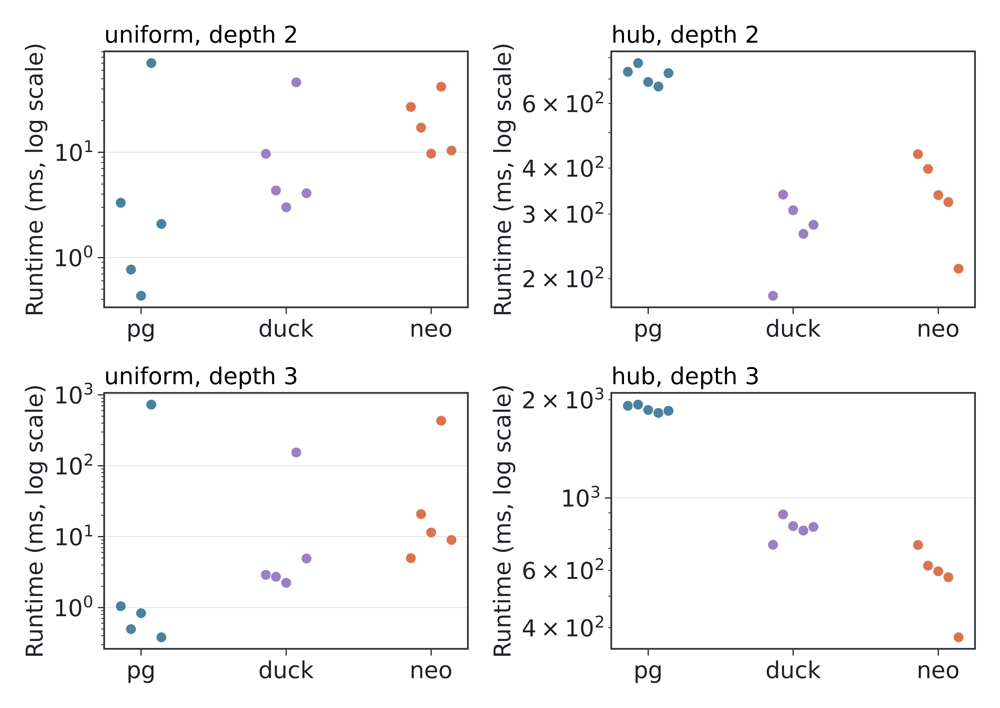

# DRKG Query Benchmark

This project compares PostgreSQL, Neo4j, and DuckDB on DRKG query workloads. It studies fixed conjunctive queries over paths, triangles, and a 4-cycle, plus bounded directional reachability. The analysis uses database systems behavior and CS 784 ideas: skew, join order, acyclic versus cyclic structure, and AGM-style output bounds.

## Outline

1. **Problem and motivation:** compare graph, row-store SQL, and columnar SQL execution on matched DRKG workloads.
2. **Data preparation:** clean DRKG, drop malformed endpoints, deduplicate directed triples, and keep a common graph for all engines.
3. **Workload construction:** mine typed templates, select `P2`, `P3`, `T1`, `T2`, and `C4`, then sample hub-anchored and uniform-random bindings.
4. **Systems and protocol:** load PostgreSQL, Neo4j, and DuckDB; run matched fixed-query benchmarks; run PostgreSQL join-order experiments; run bounded reachability.
5. **Theory lens:** classify templates by acyclic/cyclic structure and compare runtime against output size, intermediate work, skew, and AGM-style bounds.
6. **Results:** show that skew and intermediate expansion dominate the simple acyclic/cyclic story.

## Dataset

The benchmark uses the Drug Repurposing Knowledge Graph (DRKG), a directed biomedical knowledge graph whose nodes include entities such as compounds, genes, diseases, and biological processes. Edges are typed relations from the raw DRKG triples.

The pipeline treats `data/drkg.tsv` as the authoritative directed edge list. Metadata files such as the relation glossary and entity-source table are used for context, not for changing edge direction. During preprocessing, the project:

- derives each node type from the prefix before `::`
- drops rows with empty local endpoint identifiers
- deduplicates exact `(source, relation, destination)` triples
- keeps self-loops in storage, while benchmark templates require distinct node variables

The saved full run contains `5,874,229` unique directed edges, `97,237` nodes, and `107` relation types after cleaning.

## Run Commands

Set up the environment:

```bash
bash scripts/00_setup_env.sh --config config.yaml
```

Run the full benchmark:

```bash
bash scripts/run_all.sh --config config.yaml
```

Run individual phases:

```bash
bash scripts/01_phase_setup.sh --config config.yaml
bash scripts/02_phase_prepare.sh --config config.yaml
bash scripts/03_phase_experiments.sh --config config.yaml
bash scripts/04_phase_analysis.sh --config config.yaml
bash scripts/05_phase_finalize.sh --config config.yaml
```

Run a quick PostgreSQL-only milestone check:

```bash
bash scripts/run_milestone.sh --config config_milestone.yaml
```

Verify an existing full run:

```bash
bash scripts/_run_cli.sh verify-results --config config.yaml
```

## Key Results

The fixed-query benchmark has `600` matched instances across five templates, two sampling regimes, and three engines.

| Result slice | PostgreSQL median | Neo4j median | DuckDB median | Takeaway |
| --- | ---: | ---: | ---: | --- |
| `P3 / hub` | `40,905.420 ms` | `39,399.389 ms` | `1,826.620 ms` | `P3` is the stress case; DuckDB handles it much better. |
| `P3 / uniform` | `106.576 ms` | `213.775 ms` | `42.602 ms` | Removing hub skew reduces runtime sharply. |
| `C4 / hub` | `42.764 ms` | `18.733 ms` | `12.468 ms` | Cyclic does not automatically mean harder. |
| `T1 / uniform` | `3.383 ms` | `28.538 ms` | `16.086 ms` | PostgreSQL is very strong on small selective joins. |



The cross-engine result is not a simple graph-versus-SQL story. DuckDB is fastest on most fixed-query slices, PostgreSQL beats Neo4j on most slices, and Neo4j has a few lower medians such as `C4 / hub`.



The structural result is the main lesson: the acyclic `P3` path is much harder than the triangle and 4-cycle workloads. Runtime follows skew, output size, and intermediate expansion more than the acyclic-versus-cyclic label.



PostgreSQL join order matters. For `P3`, cross-product-inducing forced orders time out on every attempted binding, while connected/default orders often complete.

| Reachability slice | Reachable median | PostgreSQL | Neo4j | DuckDB | Takeaway |
| --- | ---: | ---: | ---: | ---: | --- |
| Hub, depth 2 | `45,992` | `726.589 ms` | `337.748 ms` | `280.192 ms` | Hub anchors expand broadly. |
| Hub, depth 3 | `64,843` | `1,860.033 ms` | `595.506 ms` | `814.463 ms` | Deeper hub expansion dominates runtime. |
| Uniform, depth 2 | `3` | `2.083 ms` | `17.152 ms` | `4.345 ms` | Uniform anchors stay tiny. |
| Uniform, depth 3 | `3` | `0.831 ms` | `11.459 ms` | `2.891 ms` | Anchor choice matters more than depth here. |



The resulting storyline is practical: benchmark difficulty is driven by skew, output size, and intermediate expansion more than by graph shape alone.
