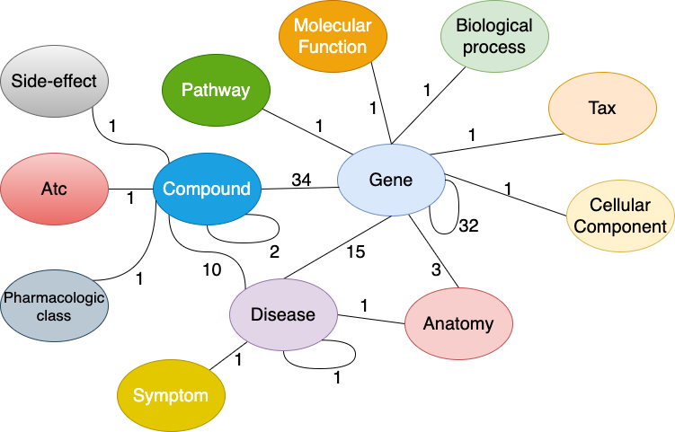

# DRKG Query Benchmark

This project compares PostgreSQL, Neo4j, and DuckDB on DRKG query workloads. It studies fixed conjunctive queries over paths, triangles, and a 4-cycle, plus bounded directional reachability. The analysis focuses on database systems behavior: skew, join order, acyclic versus cyclic structure, and AGM-style output bounds.

## Outline

1. **Problem and motivation:** compare graph, row-store SQL, and columnar SQL execution on matched DRKG workloads.
2. **Data preparation:** clean DRKG, drop malformed endpoints, deduplicate directed triples, and keep a common graph for all engines.
3. **Workload construction:** mine typed templates, select `P2`, `P3`, `T1`, `T2`, and `C4`, then sample hub-anchored and uniform-random bindings.
4. **Systems and protocol:** load PostgreSQL, Neo4j, and DuckDB; run matched fixed-query benchmarks; run PostgreSQL join-order experiments; run bounded reachability.
5. **Theory lens:** classify templates by acyclic/cyclic structure and compare runtime against output size, intermediate work, skew, and AGM-style bounds.
6. **Results:** show that skew and intermediate expansion dominate the acyclic/cyclic label.

## Dataset

The benchmark uses the [Drug Repurposing Knowledge Graph (DRKG)](https://github.com/gnn4dr/DRKG), a directed biomedical knowledge graph whose nodes include entities such as compounds, genes, diseases, and biological processes. Edges are typed relations from the raw DRKG triples.

<p align="center">
  
</p>

DRKG is stored as `(h, r, t)` triplets: `h` is the head/source entity, `r` is the relation type, and `t` is the tail/target entity.

| Head (source entity) | Relation (interaction type) | Tail (target entity) | Conceptual meaning |
| --- | --- | --- | --- |
| `Compound::DB01113` | `DRUGBANK::treats::Compound:Disease` | `Disease::DOID:8778` | A specific drug is known to treat a specific disease. |
| `Gene::7157` | `STRING::interacts::Gene:Gene` | `Gene::53` | A specific gene has a protein-protein interaction with another gene. |
| `Compound::DB00316` | `Hetionet::causes::Compound:SideEffect` | `Side Effect::C0027497` | A chemical compound causes a known side effect. |
| `Disease::DOID:10652` | `GNBR::presents::Disease:Symptom` | `Symptom::D003371` | A specific disease presents a recognized clinical symptom. |
| `Anatomy::UBERON:0002048` | `Hetionet::expresses::Anatomy:Gene` | `Gene::351` | A specific anatomical structure expresses a certain gene. |

The pipeline treats `data/drkg.tsv` as the authoritative directed edge list over biomedical entity types such as compounds, diseases, genes, anatomy, pathways, and side effects. Metadata files such as the relation glossary and entity-source table are used for context, not for changing edge direction. During preprocessing, the project:

- derives each node type from the prefix before `::`
- drops rows with empty local endpoint identifiers
- deduplicates exact `(source, relation, destination)` triples
- keeps self-loops in storage, while benchmark templates require distinct node variables

Data representation:

| Layer | Structure |
| --- | --- |
| Raw DRKG edge | `(src_id, rel_type, dst_id)` directed triple |
| Derived node | `(node_id, node_type)`, where `node_type` is the prefix before `::` |
| PostgreSQL / DuckDB nodes | `nodes(node_id, node_type)` |
| PostgreSQL / DuckDB edges | `edges(src_id, dst_id, rel_type)` |
| Neo4j nodes | `(:Entity {node_id, node_type})` |
| Neo4j edges | directed relationships, with each raw relation mapped to a legal relationship-type token |
| Logical relation for queries | `R_t(src_id, dst_id) = edges filtered by rel_type = t` |

The saved full run contains `5,874,229` unique directed edges, `97,237` nodes, and `107` relation types after cleaning.

## Run Commands

Set up the environment:

```bash
bash scripts/00_setup_env.sh --config config.yaml
```

Run the full benchmark:

```bash
bash scripts/run_all.sh --config config.yaml
```

Run individual phases:

```bash
bash scripts/01_phase_setup.sh --config config.yaml
bash scripts/02_phase_prepare.sh --config config.yaml
bash scripts/03_phase_experiments.sh --config config.yaml
bash scripts/04_phase_analysis.sh --config config.yaml
bash scripts/05_phase_finalize.sh --config config.yaml
```

Run a quick PostgreSQL-only milestone check:

```bash
bash scripts/run_milestone.sh --config config_milestone.yaml
```

Verify an existing full run:

```bash
bash scripts/_run_cli.sh verify-results --config config.yaml
```

## Key Results

The fixed-query benchmark has `600` matched instances across five templates, two sampling regimes, and three engines.

| Result slice | PostgreSQL median | Neo4j median | DuckDB median | Takeaway |
| --- | ---: | ---: | ---: | --- |
| `P3 / hub` | `40,905.420 ms` | `39,399.389 ms` | `1,826.620 ms` | `P3` is the stress case; DuckDB handles it much better. |
| `P3 / uniform` | `106.576 ms` | `213.775 ms` | `42.602 ms` | Removing hub skew reduces runtime sharply. |
| `C4 / hub` | `42.764 ms` | `18.733 ms` | `12.468 ms` | Cyclic does not automatically mean harder. |
| `T1 / uniform` | `3.383 ms` | `28.538 ms` | `16.086 ms` | PostgreSQL is very strong on small selective joins. |

<p align="center">
  
</p>

DuckDB is fastest on most fixed-query slices, PostgreSQL beats Neo4j on most slices, and Neo4j has a few lower medians such as `C4 / hub`.

<p align="center">
  
</p>

The acyclic `P3` path is much harder than the triangle and 4-cycle workloads. Runtime follows skew, output size, and intermediate expansion more than the acyclic-versus-cyclic label.

<p align="center">
  
</p>

PostgreSQL join order matters. For `P3`, cross-product-inducing forced orders time out on every attempted binding, while connected/default orders often complete.

| Reachability slice | Reachable median | PostgreSQL | Neo4j | DuckDB | Takeaway |
| --- | ---: | ---: | ---: | ---: | --- |
| Hub, depth 2 | `45,992` | `726.589 ms` | `337.748 ms` | `280.192 ms` | Hub anchors expand broadly. |
| Hub, depth 3 | `64,843` | `1,860.033 ms` | `595.506 ms` | `814.463 ms` | Deeper hub expansion dominates runtime. |
| Uniform, depth 2 | `3` | `2.083 ms` | `17.152 ms` | `4.345 ms` | Uniform anchors stay tiny. |
| Uniform, depth 3 | `3` | `0.831 ms` | `11.459 ms` | `2.891 ms` | Anchor choice matters more than depth here. |

<p align="center">
  
</p>

Overall, benchmark difficulty is driven by skew, output size, and intermediate expansion more than by graph shape alone.
